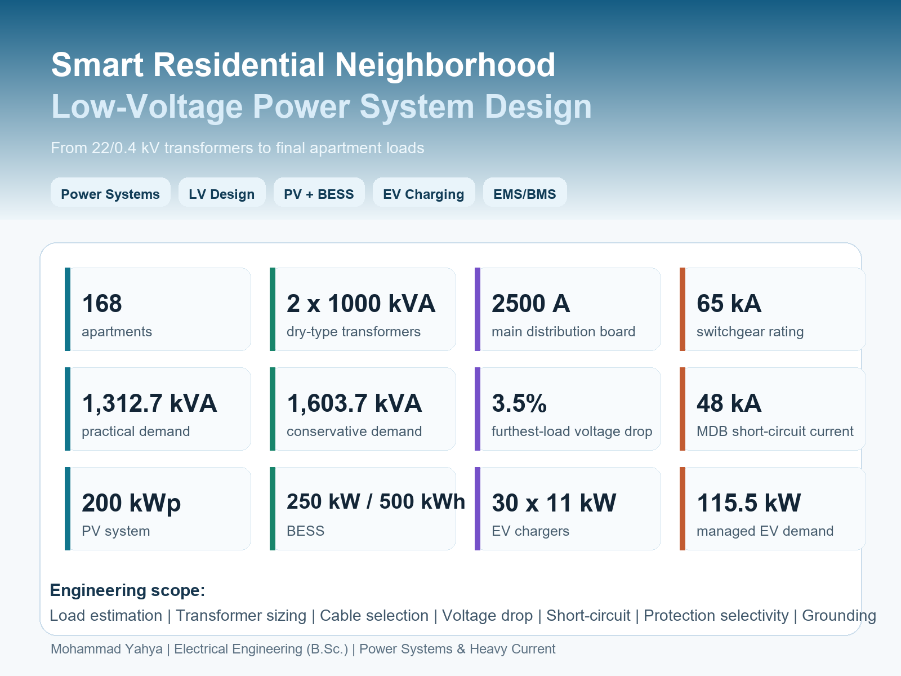
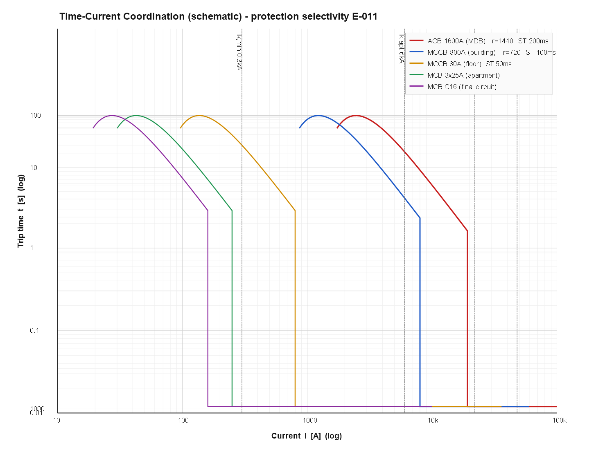
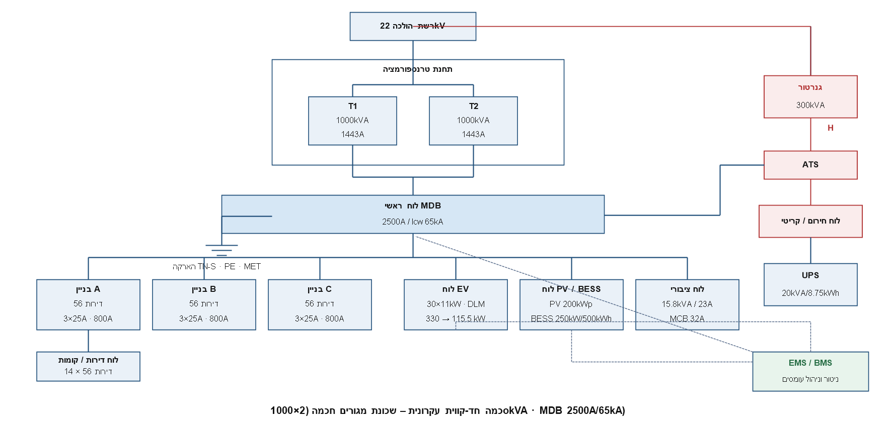
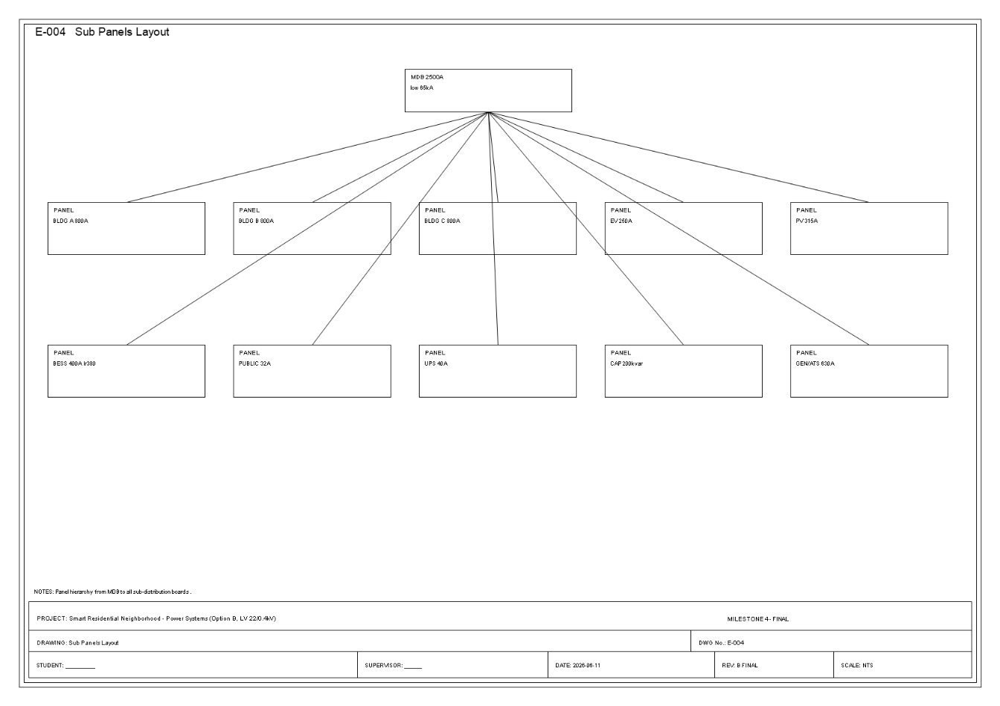
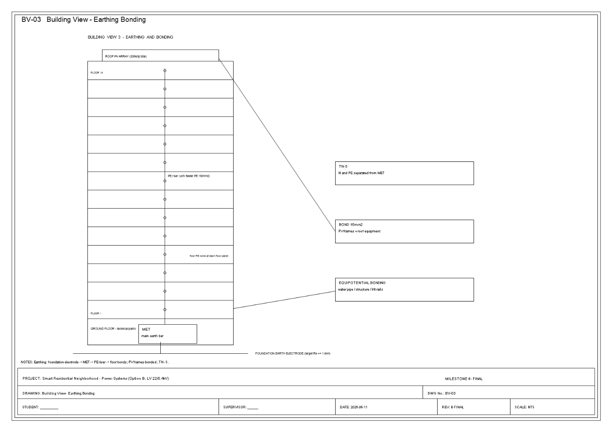

# Smart Residential Neighborhood Low-Voltage Power System Design

## Overview

Power systems project for a smart residential neighborhood, from 22/0.4 kV transformers to low-voltage distribution, PV, BESS, EV charging, emergency power, protection, and grounding.

## Technical Highlights

- Three residential buildings and 168 apartments.
- Two 1000 kVA dry-type transformers.
- 2500 A main distribution board.
- PV, BESS, EV charging, generator, UPS, and capacitor-bank integration.
- Voltage-drop, short-circuit, protection, grounding, and panel-schedule calculations.

## Tech Stack

Power Systems, Low Voltage Design, IEC 60909, Protection Coordination, PV, BESS, EV Charging

## Results

- Practical demand: 1,312.7 kVA.
- Conservative demand: 1,603.7 kVA.
- Transformer loading: 65.6% practical / 80.2% conservative.
- Furthest-load voltage drop about 3.5%, below 5%.
- MDB short-circuit current about 48 kA, with 65 kA equipment selected.
- PV: 200 kWp; BESS: 250 kW / 500 kWh; EV charging: 30 x 11 kW managed to 115.5 kW.

## How to Run or Review

- Review the summary and result visual in `assets/images`.

## Repository Notes

- This repository is prepared as a clean public GitHub portfolio version.
- Original course reports that contain student IDs or private details are not committed.
- The committed material focuses on source code, safe visuals, result screenshots, and a technical summary.

## Visuals

## Full Project Package

This repository now includes the complete public project package:

- `docs/full_report_redacted.md` - full technical report text with private identifiers removed.
- `assets/full_report_media/` or `assets/full_report_pages/` - report figures/pages where available.
- Project source/configuration folders where the original project included runnable code or design files.

Original raw report archives are not committed because they can contain private student metadata in covers, headers, or document properties.

## Public File Coverage

See `docs/public_file_coverage.md` for the complete list of public-safe project files included and the raw/private material intentionally excluded.
